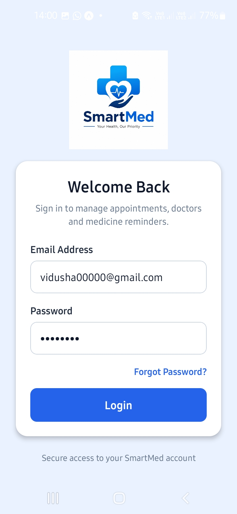
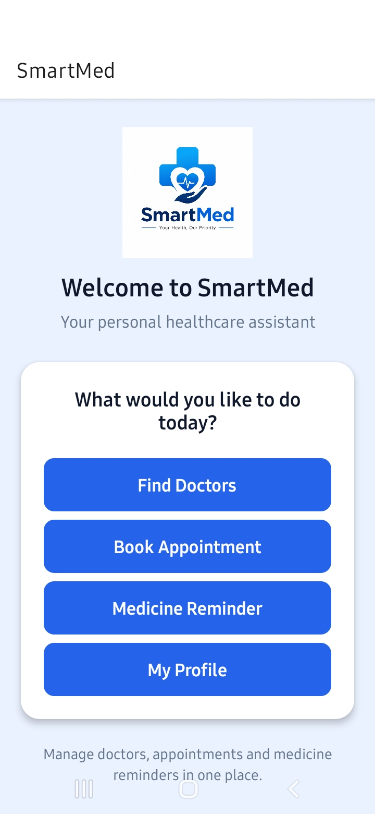
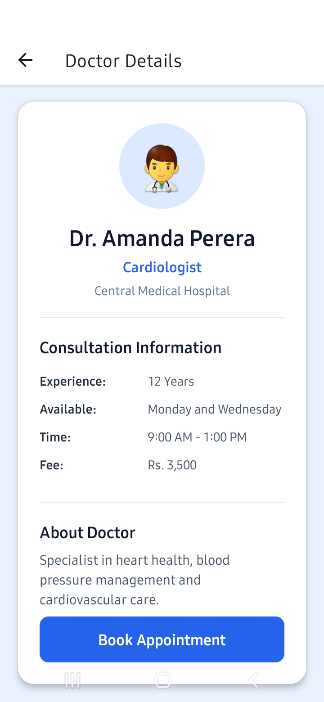
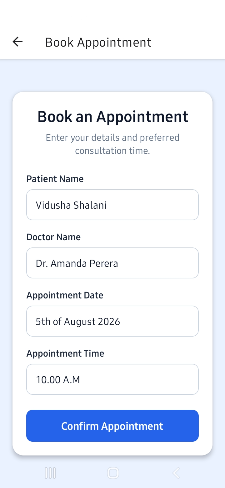
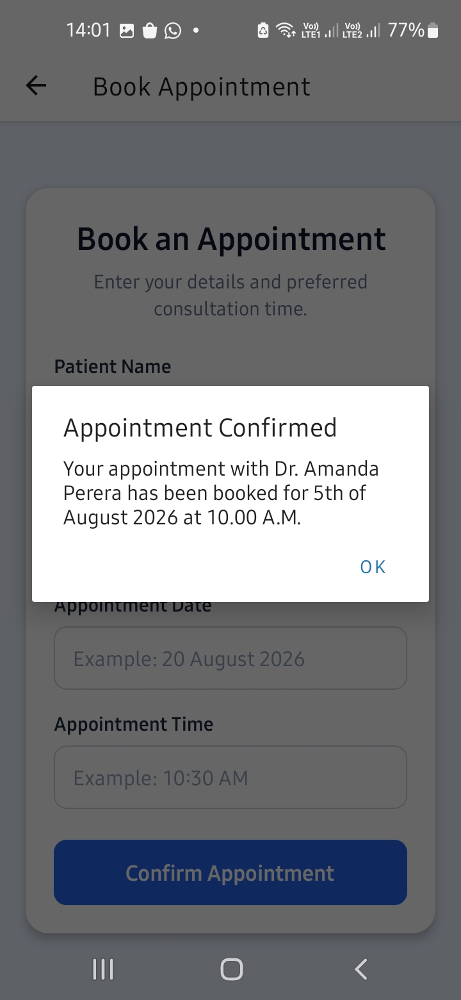
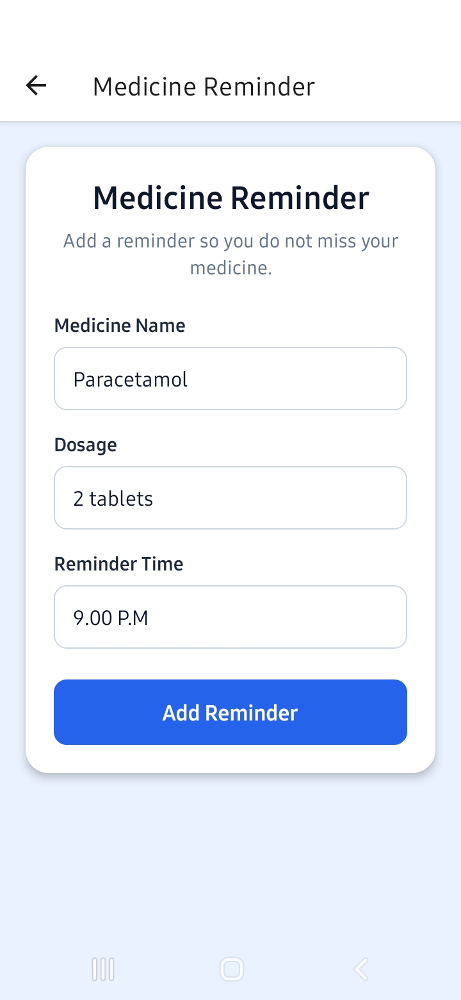
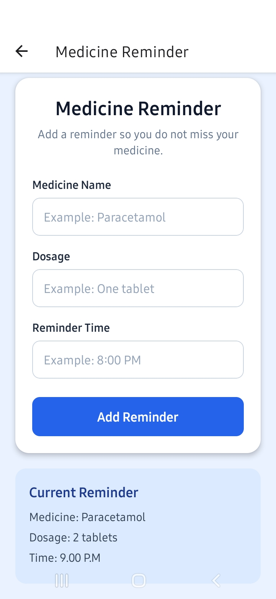
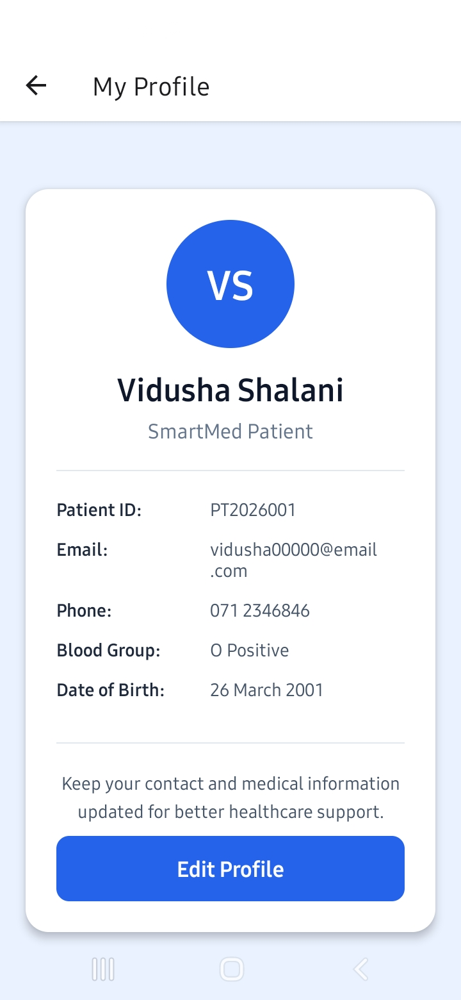

# SmartMed

## Healthcare Appointment Management Mobile Application

## Target Domain 

Healthcare

---

## Application Overview

SmartMed is a Mobile Application for the purpose of helping patients to manage their healthcare services in one single portal. SmartMed helps to view doctors details and book appointments. Also it helps to set medicine reminders, and view your personal profile information.

---

## Problem Statement

For many patients it difficult to manage doctor appointments and remember their medication schedules. Such patients will require a simple mobile app to give them access to information about healthcare services.

---

## Solution

SmartMed provides a simple and user-friendly healthcare application that allow users to:

- View a list of available doctors.
- View detailed information about each doctor.
- Book medical appointments.
- Set medicine reminders.
- View patient profile information.

The app helps users manage their healthcare activities more effectively through a clean and a simple user interface on the mobile.

---

## Features

- User Login
- Home Screen
- Doctor List
- Doctor Details
- Appointment Booking
- Medicine Reminder
- Patient Profile
- Navigation between multiple screens
- FlatList displaying doctor information
- Local data storage using a JavaScript data array
- State management using React useState

---

## Technologies Used

- React Native
- Expo
- JavaScript
- FlatList
- React Hooks (useState)

---

## Project Structure

```

SmartMed
| 
|--- assets /
|         |---images /
|
|---components /
|         |---DoctorCard.js
|         |---InfoRow.js
|         |---InputField.js
|         |---PrimaryButton.js
|         |---ProfileCard.js
|
|---data /
|         |---doctors.js
|
|---screens /
|        |---LoginScreen.js
|        |---HomeScreen.js
|        |---DoctorListScreen.js    
|        |---DoctorDetailsScreen.js
|        |---AppointmentScreen.js
|        |---MedicineReminderScreen.js
|        |---ProfileScreen.js
|
|---screenshots /
|        |--- loginpage.jpeg
|        |--- homescreen.jpeg
|        |--- doctor-list.jpeg
|        |--- doctor-details.jpeg
|        |--- appointment-former.jpeg
|        |--- appointment-confirmation.jpeg
|        |--- medicine-reminder1.jpeg
|        |--- medicine-reminder2.jpeg
|        |--- profile.jpeg
|
|---App.js
|---app.json
|---package.json
|---README.md
|---package-lock.json

```

---

## Setup Instructions

### 1. Clone the repository

```bash
git clone <repository-link>
```

### 2. Open the project

```bash
cd SmartMed
```

### 3. Install dependencies

```bash
npm install
```

### 4. Start the Expo development server

```bash
npx expo start
```

### 5. Run the application

- Scan the QR code using the Expo Go app on an Android phone or Iphone

---

## Screenshots

### Login Screen



### Home Screen



### Doctor List Screen


### Doctor Details Screen



### Appointment Screen




### Medicine Reminder Screen




### Profile Screen



--- 

## Author

**Vidusha Shalani**

CSI2114 - Mobile Application Development

Advanced Diploma in Computer Science

Australian College of Business and Technology (ACBT)

---